# Ejercicio de consultas en base de datos ***dvdrental***

> ## 1. Selecciona las columnas film_id y title de la tabla film.

### Codigo
```sql
SELECT film_id, title FROM film;
```
### Evidencia
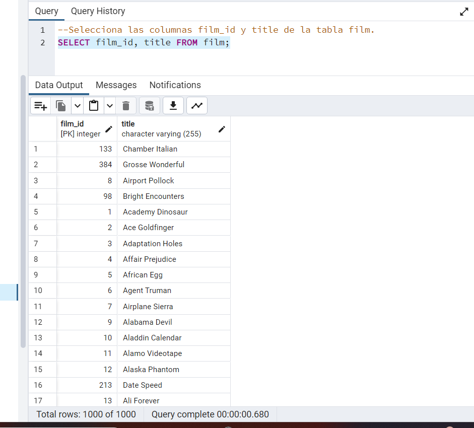

> ## 2. Selecciona 5 filas de la tabla film, obteniendo todas las columnas.

### Codigo
```sql
SELECT * FROM film LIMIT 5;
```
### Evidencia
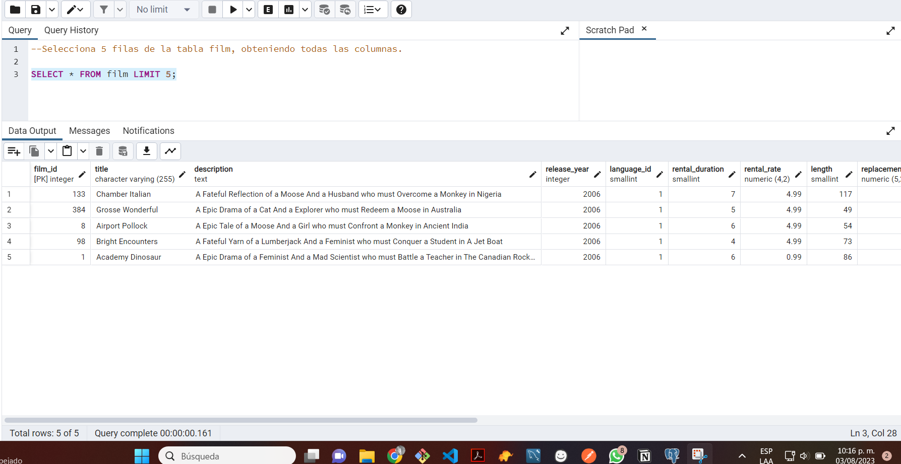

> ## 3. Selecciona filas de la tabla film donde film_id sea menor que 4.

### Codigo
```sql
SELECT * FROM film WHERE film_id<4;
```
### Evidencia
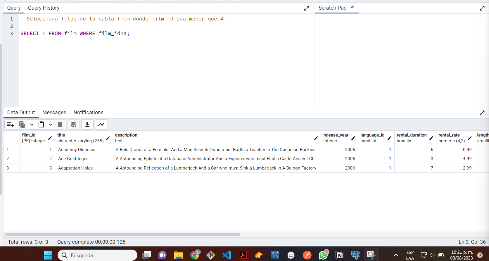

> ## 4. Selecciona filas de la tabla film donde el rating sea PG o G.

### Codigo
```sql
SELECT * FROM film WHERE rating = 'PG' OR rating = 'G';
```
### Evidencia
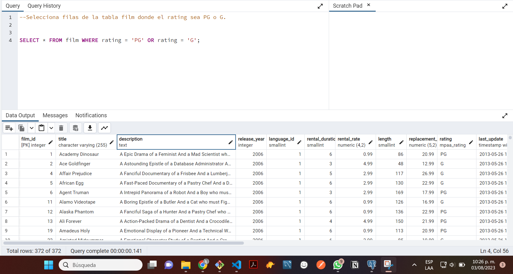

> ## 5. Selecciona filas de la tabla actor donde el nombre sea Angela, Angelina o Audrey usando IN.

### Codigo
```sql
SELECT * FROM actor WHERE first_name IN ('Angela', 'Angelina', 'Audrey');
```
### Evidencia
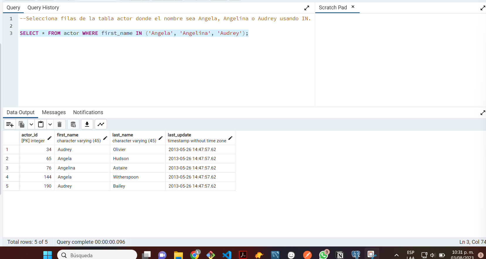

> ## 6. Obtén una lista de actores con el nombre Julia.

### Codigo
```sql
SELECT first_name, last_name FROM actor WHERE first_name = 'Julia';
```
### Evidencia
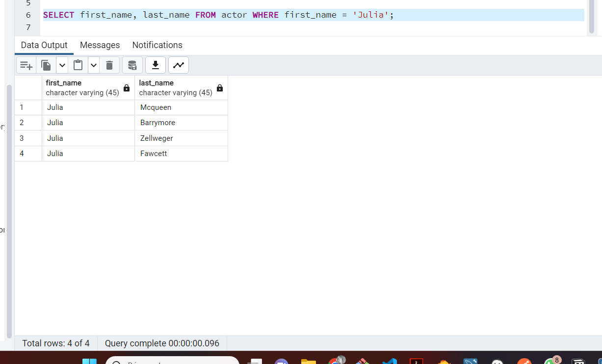

> ## 7. Obtén una lista de actores con los nombres Chris, Cameron o Cuba.

### Codigo
```sql
SELECT first_name, last_name FROM actor WHERE first_name = 'Chris' OR first_name = 'Cameron' OR first_name = 'Cuba';
```
### Evidencia
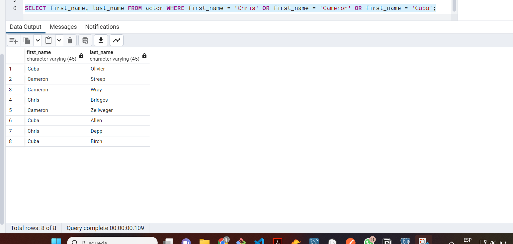

> ## 8. Selecciona la fila de la tabla customer para el cliente con el nombre Jamie Rice.

### Codigo
```sql
SELECT first_name, last_name FROM customer WHERE first_name = 'Jamie' AND last_name = 'Rice';
```
### Evidencia
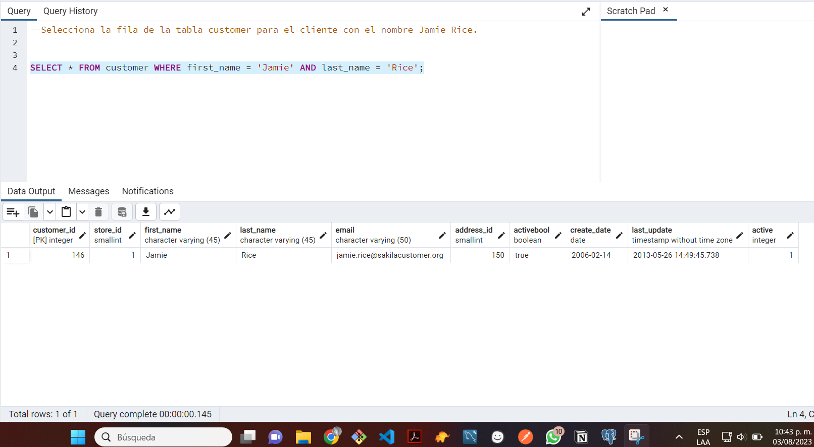

> ## 9. Selecciona el monto y la fecha de pago de la tabla payment donde el monto pagado sea menor a $1.

### Codigo
```sql
SELECT amount, payment_date FROM payment WHERE amount <1;
```
### Evidencia
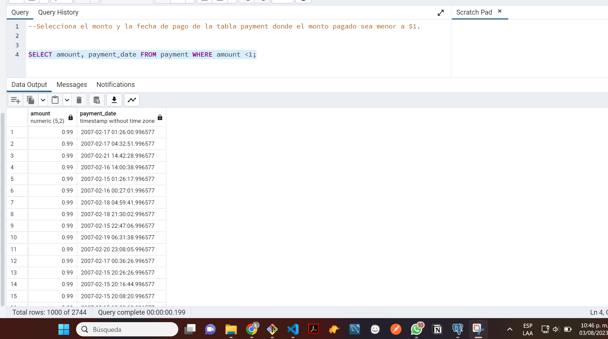.

> ## 10. ¿Cuáles son las diferentes duraciones de alquiler permitidas por la tienda?

### Codigo
```sql
SELECT DISTINCT last_update FROM rental;
```
### Evidencia
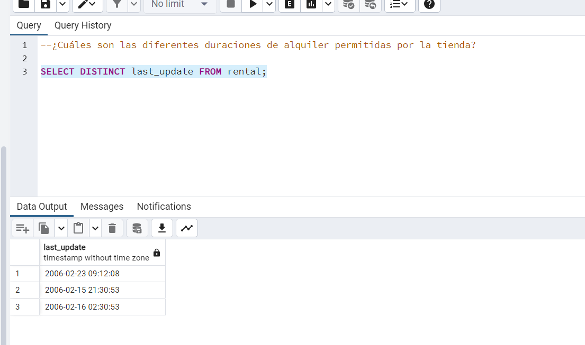

> ## 11. Ordena las filas en la tabla city por country_id y luego por city.

### Codigo
```sql
SELECT * FROM city ORDER BY country_id ASC, city DESC;
```
### Evidencia
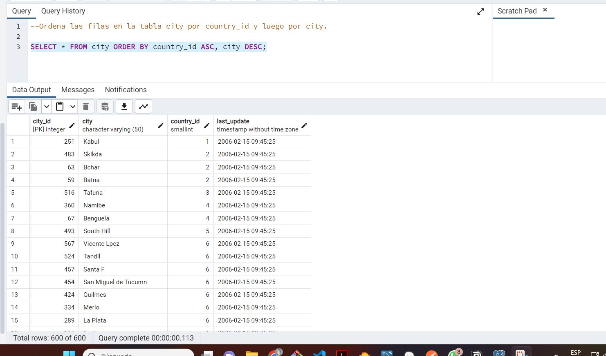

> ## 12. ¿Cuáles son los ID de los últimos 3 clientes que devolvieron un alquiler?

### Codigo
```sql
SELECT customer_id FROM rental ORDER BY return_date DESC LIMIT 3;
```
### Evidencia
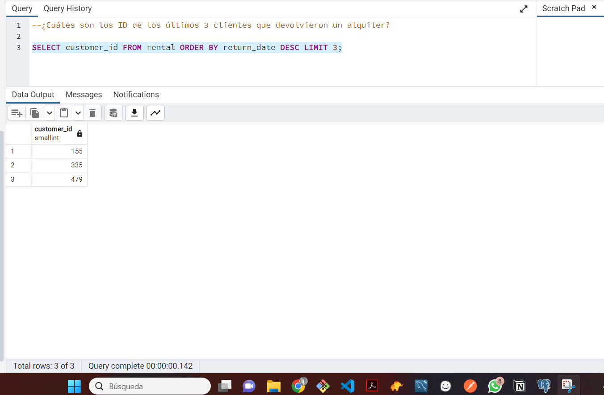

> ## 13. ¿Cuántas películas tienen clasificación NC-17? ¿Cuántas tienen clasificación PG o PG-13?

### Codigo
```sql
SELECT rating, COUNT(rating) FROM film WHERE rating='NC-17' OR rating='PG' OR rating='PG-13' GROUP BY rating;
--Un IN es similar a un OR
```
### Evidencia
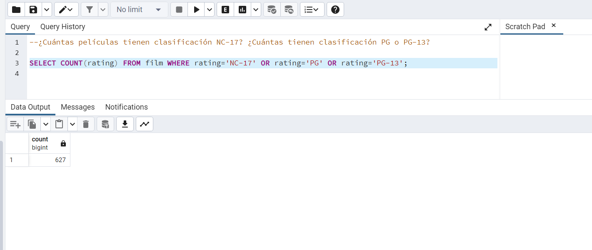

> ## 14. ¿Cuántos clientes diferentes tienen registros en la tabla rental?

### Codigo
```sql
SELECT COUNT(DISTINCT customer_id) FROM rental;
```
### Evidencia
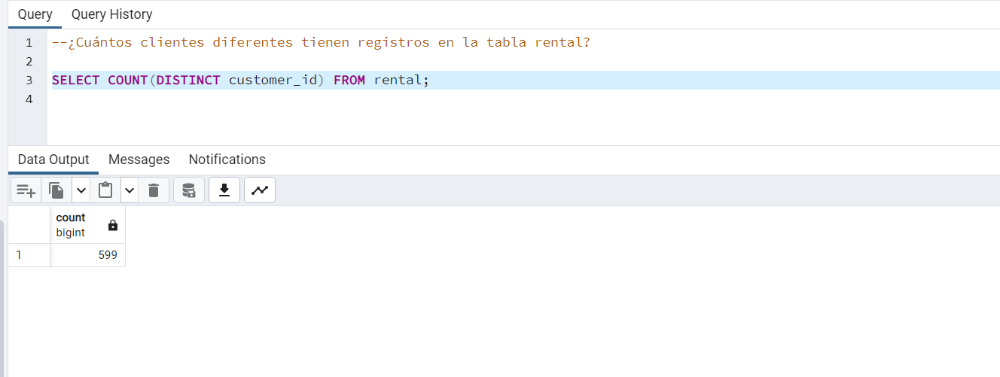

> ## 15. ¿Hay algún cliente con el mismo apellido?

### Codigo
```sql
SELECT last_name FROM customer GROUP BY last_name HAVING COUNT(*) > 1;
```
### Evidencia
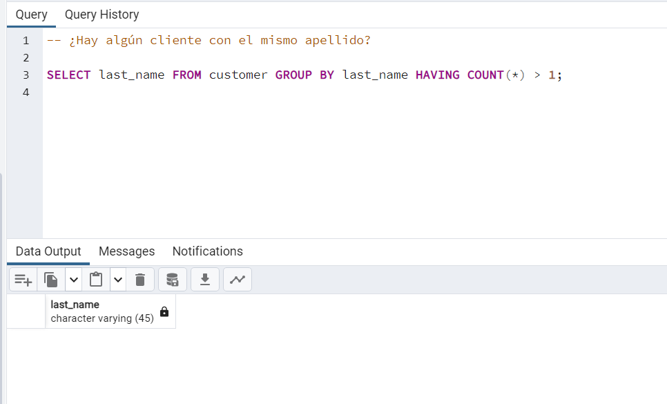

> ## 16. ¿Qué película (id) tiene la mayor cantidad de actores?

### Codigo
```sql
SELECT film_id, COUNT(actor_id) AS num_actors
FROM film_actor
GROUP BY film_id
ORDER BY num_actors DESC
LIMIT 1;
```
### Evidencia
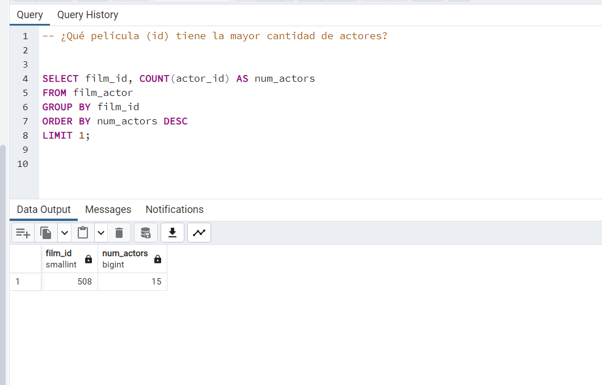


> ## 17. ¿Qué actor (id) aparece en la mayor cantidad de películas?

### Codigo
```sql
SELECT actor_id, COUNT(film_id) AS num_films
FROM film_actor
GROUP BY actor_id
ORDER BY num_films DESC
LIMIT 1;
```
### Evidencia
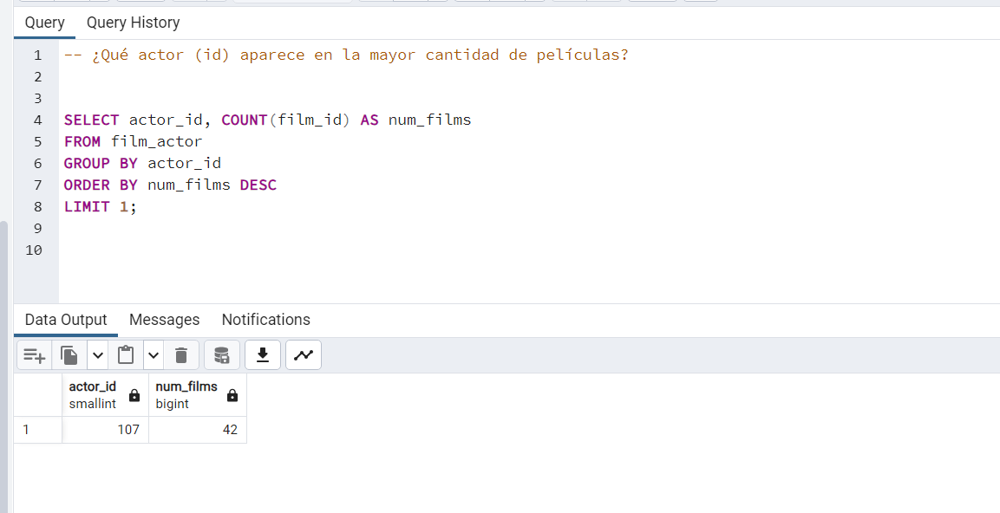

> ## 18. Cuenta el número de ciudades para cada country_id en la tabla city. Ordena los resultados por count(*).

### Codigo
```sql
SELECT country_id, COUNT(*) AS num_ciudades
FROM city
GROUP BY country_id
ORDER BY COUNT(*) DESC;
```
### Evidencia
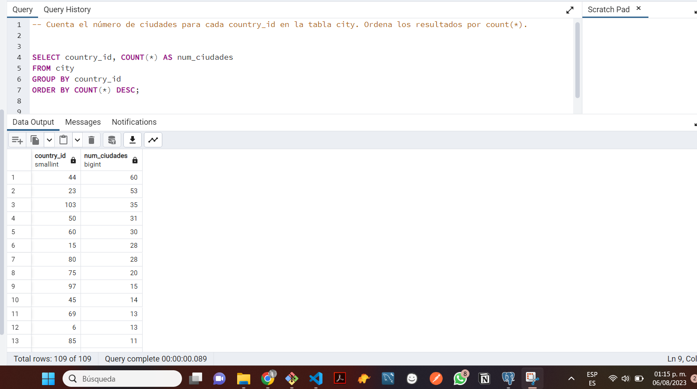

> ## 19. ¿Cuál es la tarifa de alquiler promedio de las películas? ¿Puedes redondear el resultado a 2 decimales?

### Codigo
```sql
SELECT ROUND(AVG(rental_rate), 2) AS tarifa_promedio FROM film;
```
### Evidencia
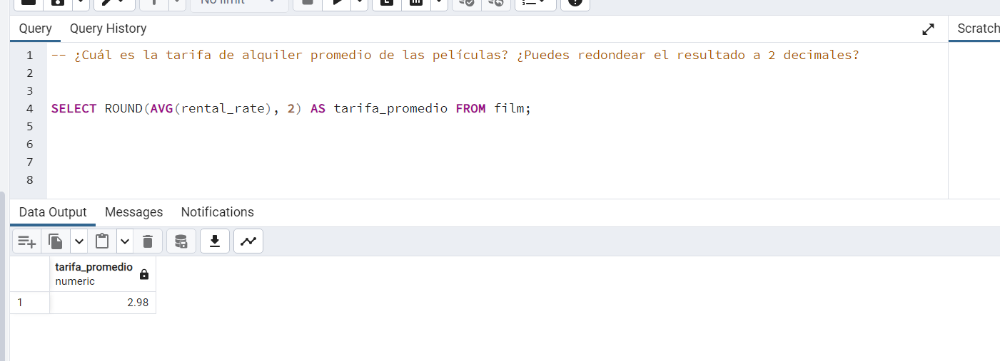

> ## 20. Selecciona los 10 actores que tienen los nombres más largos (nombre y apellido combinados).

### Codigo
```sql
SELECT actor_id, CONCAT(first_name, ' ', last_name) AS nombre_completo
FROM actor
ORDER BY LENGTH(CONCAT(first_name, ' ', last_name)) DESC
LIMIT 10;
```
### Evidencia
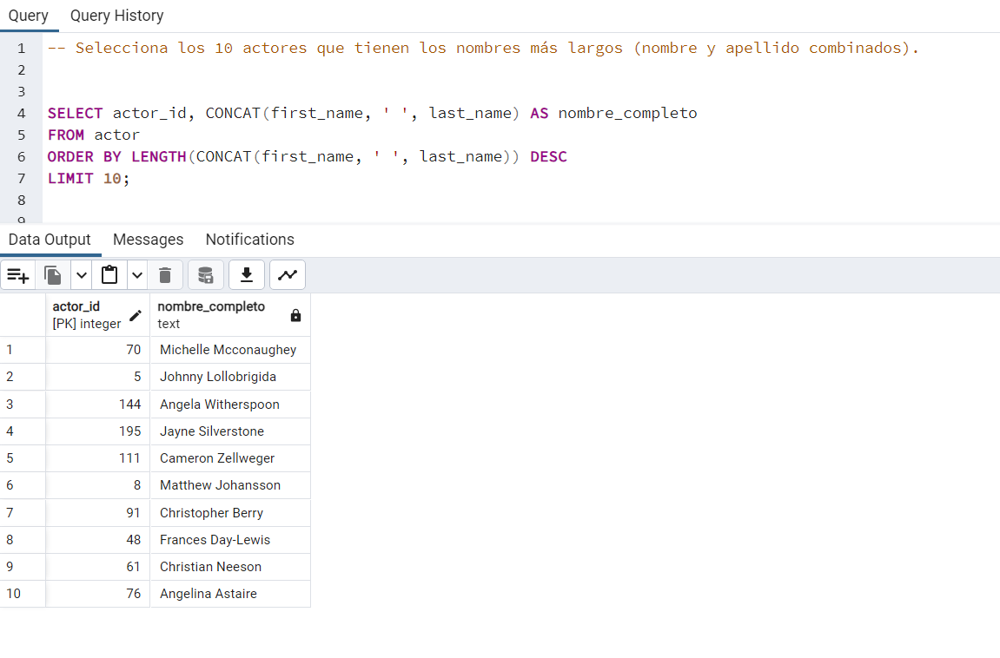